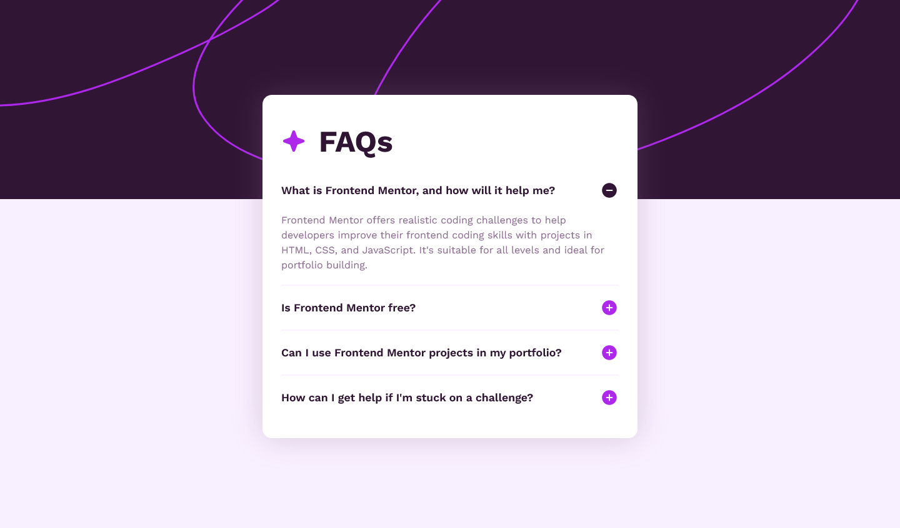

# Frontend Mentor - FAQ accordion solution

This is a solution to the [FAQ accordion challenge on Frontend Mentor](https://www.frontendmentor.io/challenges/faq-accordion-wyfFdeBwBz). Frontend Mentor challenges help you improve your coding skills by building realistic projects. 

## Table of contents

- [Overview](#overview)
  - [The challenge](#the-challenge)
  - [Links](#links)
  - [Screenshot](#screenshots)
- [My process](#my-process)
  - [Built with](#built-with)
- [Author](#author)

## Overview

### The challenge

#### Instructions

Create an Accordion FAQ page based on the provided mockups. Assets are provided and (style_guide.md)[./style-guide.md] contains color schemes and font sizes.

#### Requirements

Users should be able to:

- Hide/Show the answer to a question when the question is clicked
- Navigate the questions and hide/show answers using keyboard navigation alone
- View the optimal layout for the interface depending on their device's screen size
- See hover and focus states for all interactive elements on the page

### Links

- Live Demo: [Vercel Deployment](https://your-solution-url.com)
- My Portfolio Website: [www.WestonVincze.com](https://westonvincze.com)

### Screenshots

#### Solution

This is a screenshot of the live project:

#### Mockup

This was the provided mockup image:

## My process

### Built with

- Vanilla JS
- CSS modules
- Webpack

I wanted a bit of a challenge so I opted to not use any JavaScript frameworks. I've built similar components with React and Vue countless times, but I don't often use Vanilla JavaScript outside of quick test projects.

I did add integration with Webpack to support CSS modules (my preferred way of writing CSS without a library), svg imports, and a static build.

I wanted to emulate large-scale application architecture even though each component is only actually used once in this project. The result is very modular and scalable with a strong separation of concerns.

I'm an advocate for type safety so I leveraged VS Code's TypeScript integration using `// @ts-check` comments and defining argument and return values.

The only asset modification I did was to improve accessibility by adding descriptive titles to the provided SVG's. 

## Author

Weston Vincze - Frontend Developer

- Website - [www.WestonVincze.com](https://www.WestonVincze.com)
- Frontend Mentor - [@WestonVincze](https://www.frontendmentor.io/profile/WestonVincze)
